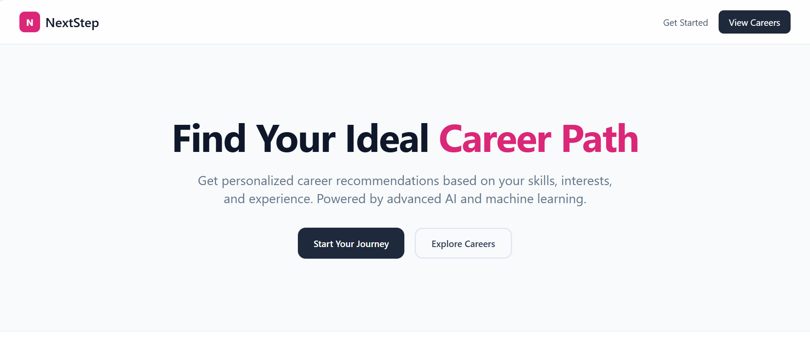
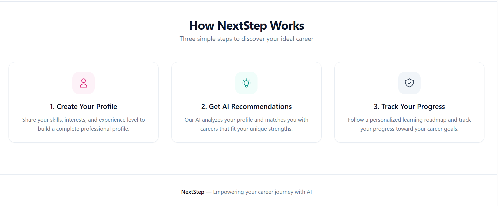
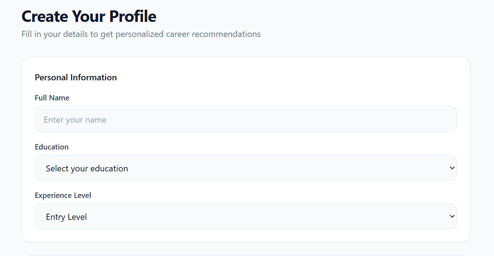
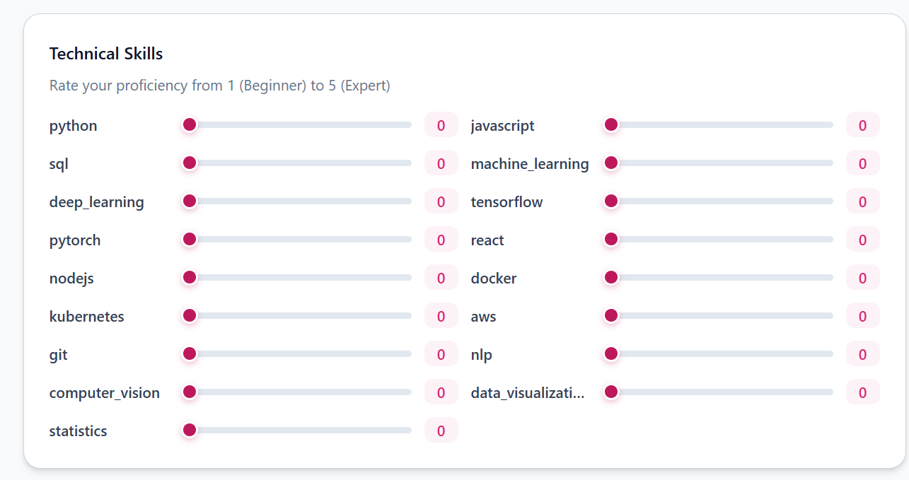
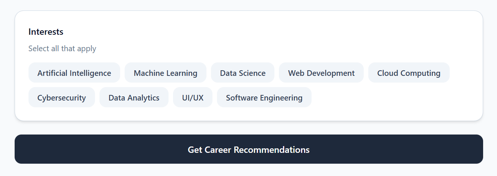
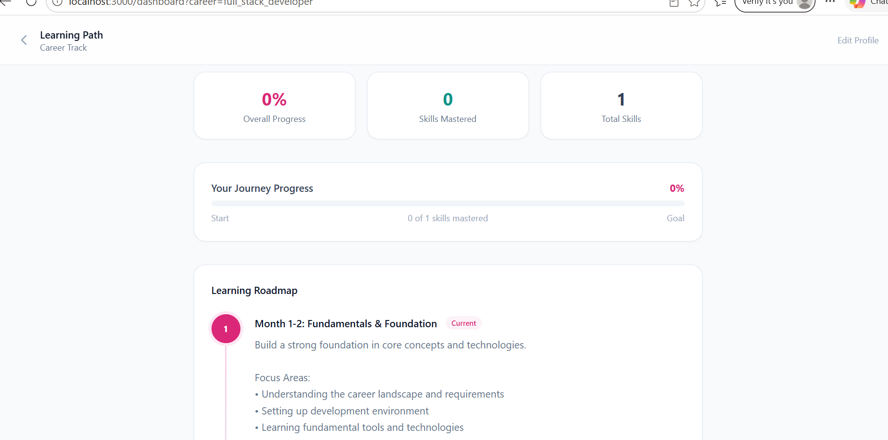
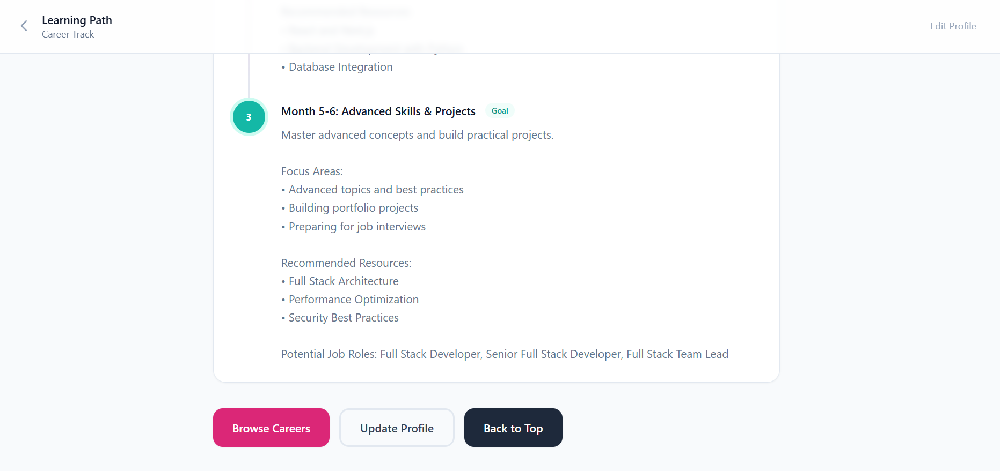

# NextStep

## AI-Powered Career Recommendation and Learning Platform

NextStep is a full-stack AI-powered platform designed to help students, interns, and aspiring professionals identify technology career paths that align with their skills, interests, education, and experience.

The platform combines a TensorFlow-based recommendation model with AI-powered guidance to transform a user profile into actionable career insights. Instead of simply suggesting a job title, CareerPath AI provides career match scores, identifies skill gaps, and generates personalized learning roadmaps to help users move toward their career goals.

This project demonstrates the integration of Machine Learning, Generative AI, backend APIs, modern frontend development, authentication, and cloud-based data storage in one complete application.

## Key Highlights

* Machine Learning-based career recommendation system
* Personalized career match scores
* Skill-gap analysis based on career requirements
* AI-generated learning roadmaps
* Interactive user dashboard and progress tracking
* Secure authentication and persistent user data
* Full-stack architecture with separate frontend and backend services

---

## Screenshots

### Landing Page





### Profile and Skill Assessment

`
`
`

### Career Recommendations





---

## How It Works

1. The user creates a profile by providing skills, interests, education, and experience information.

2. The backend processes the profile and prepares the input features for the recommendation model.

3. The TensorFlow model analyzes the profile and predicts suitable career paths.

4. The platform returns personalized career recommendations with match scores.

5. Career requirements are compared with the user's current skills to identify skill gaps.

6. AI generates a structured learning roadmap to help the user develop the required skills.

7. User progress and learning history are stored securely using Firebase.

---

## System Architecture

```text
                         Next.js Frontend
                   React and Tailwind CSS
                                |
                                |
                                v
                         FastAPI Backend
                    APIs and Business Logic
                                |
               -------------------------------
               |              |              |
               v              v              v
        TensorFlow Model    Groq AI       Firebase
        Career Matching     Roadmaps      Auth and DB
```

The frontend provides the user interface, while FastAPI manages application logic and communication with the AI and Machine Learning services. Firebase handles authentication and persistent user data.

---

## Technology Stack

| Category         | Technologies                             |
| ---------------- | ---------------------------------------- |
| Frontend         | Next.js, React, TypeScript, Tailwind CSS |
| Backend          | Python, FastAPI                          |
| Machine Learning | TensorFlow, NumPy, Pandas                |
| AI Integration   | Groq API                                 |
| Database         | Firebase Firestore                       |
| Authentication   | Firebase Authentication                  |
| Deployment       | Vercel, Render                           |

---

## Machine Learning Model

The career recommendation engine is built using TensorFlow and analyzes user profile features to predict suitable technology career paths.

The model considers information such as:

* Technical skills and proficiency levels
* Career interests
* Educational background
* Experience level
* Skill relationships between different career domains

The model supports recommendations across multiple technology roles, including:

* AI Engineer
* Machine Learning Engineer
* Data Scientist
* Data Analyst
* Backend Developer
* Full Stack Developer
* Frontend Developer
* Cloud Engineer
* DevOps Engineer
* Cybersecurity Analyst
* Computer Vision Engineer
* NLP Engineer
* Data Engineer
* Software Engineer
* AI Product Engineer

### Model Performance

| Metric              | Result |
| ------------------- | ------ |
| Training Accuracy   | 87%    |
| Validation Accuracy | 85%    |
| Top-3 Accuracy      | 92%    |
| Training Samples    | 5,000+ |
| Career Classes      | 15+    |

---

## Project Structure

```text
careerpath-ai/

├── frontend/
│   ├── app/
│   ├── components/
│   ├── services/
│   └── types/
│
├── backend/
│   ├── routes/
│   ├── services/
│   ├── models/
│   ├── ml_integration/
│   └── data/
│
├── ml/
│   ├── dataset/
│   ├── train.py
│   ├── evaluate.py
│   └── saved_model/
│
├── screenshots/
│
├── README.md
└── LICENSE
```

---

## Installation

### Clone the Repository

```bash
git clone https://github.com/yourusername/careerpath-ai.git
cd careerpath-ai
```

### Backend Setup

```bash
cd backend

python -m venv venv
```

Activate the virtual environment.

Windows:

```bash
venv\Scripts\activate
```

Install dependencies:

```bash
pip install -r requirements.txt
```

Run the backend:

```bash
python main.py
```

The backend will run at:

```text
http://localhost:8000
```

### Frontend Setup

```bash
cd frontend
npm install
npm run dev
```

The frontend will run at:

```text
http://localhost:3000
```

API documentation is available at:

```text
http://localhost:8000/docs
```

---

## Environment Variables

Create a `.env` file inside the backend directory:

```env
GROQ_API_KEY=your_api_key
ENVIRONMENT=development
PORT=8000
ALLOWED_ORIGINS=http://localhost:3000
```

Create a `.env.local` file inside the frontend directory:

```env
NEXT_PUBLIC_API_URL=http://localhost:8000/api/v1

NEXT_PUBLIC_FIREBASE_API_KEY=your_api_key
NEXT_PUBLIC_FIREBASE_AUTH_DOMAIN=your_project.firebaseapp.com
NEXT_PUBLIC_FIREBASE_PROJECT_ID=your_project_id
```

---

## API Endpoints

| Method | Endpoint                     | Description                     |
| ------ | ---------------------------- | ------------------------------- |
| GET    | `/api/v1/health`             | Check API status                |
| GET    | `/api/v1/careers`            | Get available careers           |
| POST   | `/api/v1/recommend`          | Generate career recommendations |
| POST   | `/api/v1/skill-gap`          | Analyze skill gaps              |
| POST   | `/api/v1/roadmap`            | Generate learning roadmap       |
| GET    | `/api/v1/progress/{user_id}` | Get learning progress           |
| PUT    | `/api/v1/profile/{user_id}`  | Update user profile             |

---

## Future Improvements

* Integration with real-world job market data
* LinkedIn profile analysis
* Resume analysis
* Additional career categories
* AI-powered interview preparation
* Personalized course recommendations
* Mobile application

---

## Limitations

The current recommendation model is trained using synthetic data and is designed primarily as a demonstration of an AI-powered career recommendation workflow. Future versions can be improved by incorporating real-world user feedback, job market datasets, and larger career datasets.

---

## Author

Aiman Wazir

Aspiring Full Stack and AI Developer

## License

This project is licensed under the MIT License.
